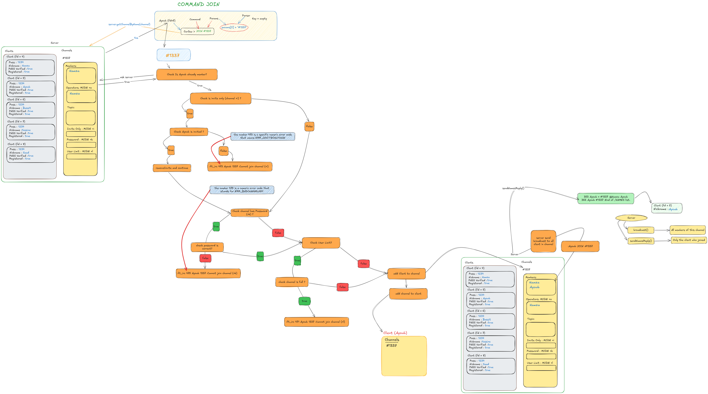
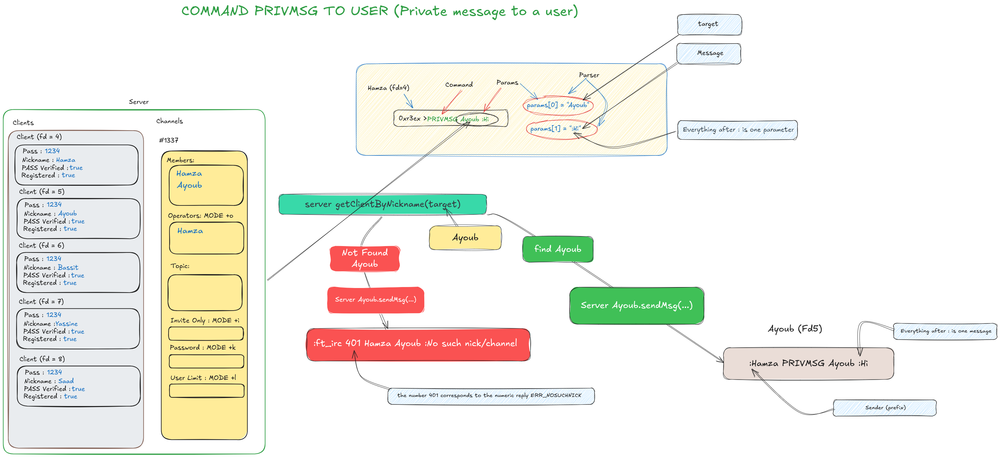
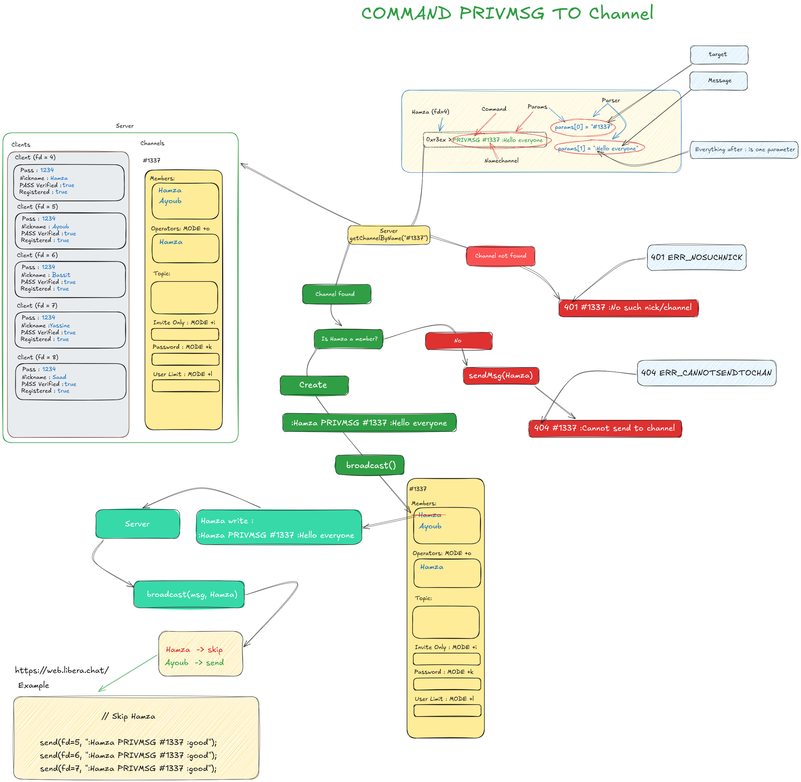
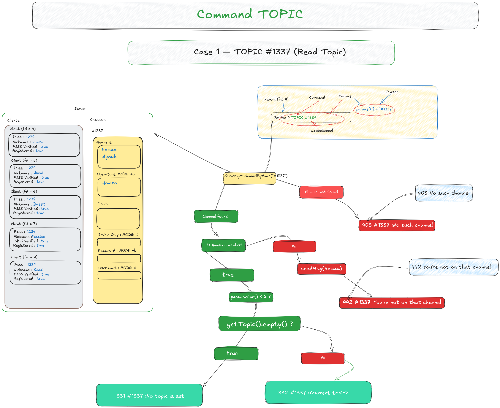
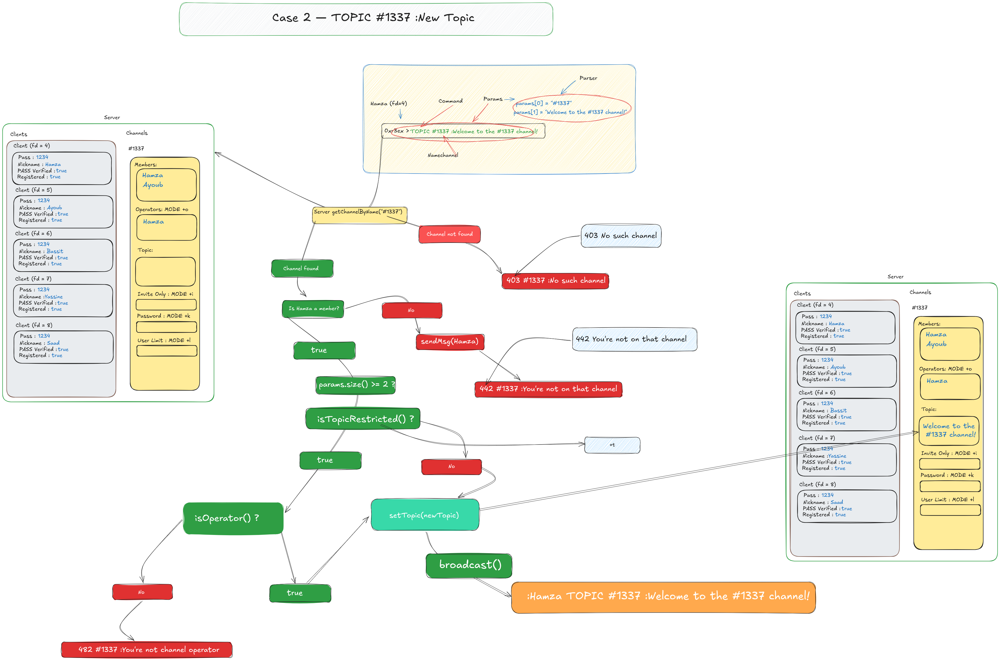
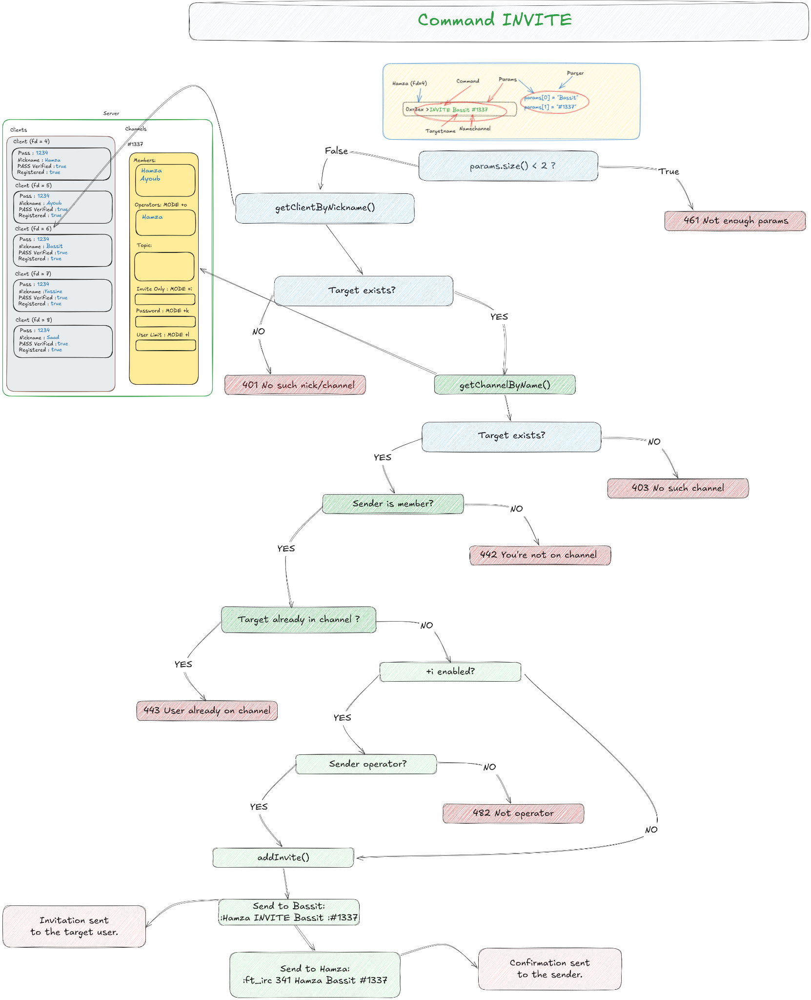
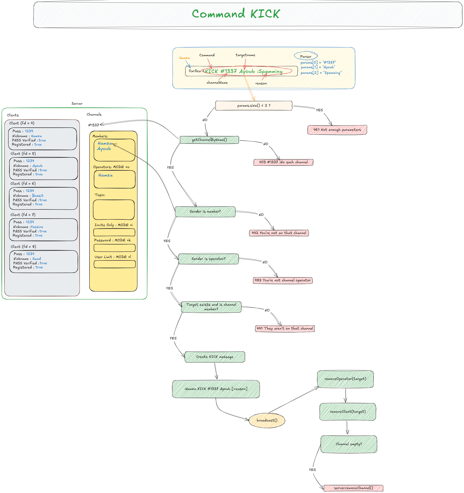
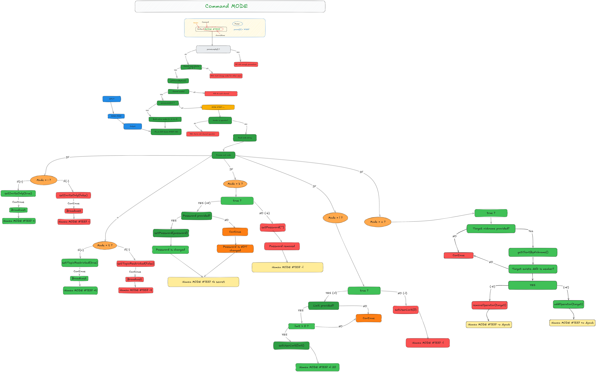

<h2>JOIN Command</h2>

The <code>JOIN</code> command allows a client to create a new channel or join an
existing one after all channel restrictions have been validated.

<h3>Creating a New Channel</h3>

    

<b>Figure 1.</b>
Execution flow when joining a channel that does not exist. The server creates
the channel, registers the client as its first member, assigns operator
privileges, and stores the new channel.

<h3>Joining an Existing Channel</h3>

    

<b>Figure 2.</b>
Execution flow when joining an existing channel. The server validates channel
restrictions such as invite-only mode, password protection, and user limit
before adding the client.

<h2>PRIVMSG Command (Private Message)</h2>

The <code>PRIVMSG</code> command sends a private message directly to another
connected client.

<h3>Flow Diagram</h3>

    

<b>Figure.</b>
The server validates the target nickname. If the user exists, the message is
forwarded; otherwise, <code>401 ERR_NOSUCHNICK</code> is returned.

<h2>PRIVMSG Command (Channel Message)</h2>

The <code>PRIVMSG</code> command broadcasts a message to all members of a
channel except the sender.

<h3>Flow Diagram</h3>

    

<b>Figure.</b>
The server verifies the channel, checks that the sender belongs to it, and then
broadcasts the message to every other channel member.

<h2>TOPIC Command (Read Topic)</h2>

The <code>TOPIC</code> command retrieves the current topic of a channel.

<h3>Flow Diagram</h3>

    

<b>Figure.</b>
The server validates the channel and membership before returning either the
current topic or indicating that no topic has been set.

<h2>TOPIC Command (Update Topic)</h2>

The <code>TOPIC</code> command updates the channel topic when the client has the
required permissions.

<h3>Flow Diagram</h3>

    

<b>Figure.</b>
The server validates permissions, updates the topic, and broadcasts the new
topic to all channel members.

<h2>INVITE Command</h2>

The <code>INVITE</code> command allows a client to invite another user into a
channel.

<h3>Flow Diagram</h3>

    

<b>Figure.</b>
The server validates the sender, target user, and channel before adding the
user to the invitation list and sending the invitation.

<h2>KICK Command</h2>

The <code>KICK</code> command removes a member from a channel.

<h3>Flow Diagram</h3>

    

<b>Figure.</b>
The server validates permissions, broadcasts the KICK message, removes the
target from the channel, and deletes the channel if it becomes empty.

<h2>MODE Command</h2>

The <code>MODE</code> command manages channel modes and operator permissions.

<h3>Supported Modes</h3>

<ul>
    <li><strong>+i / -i</strong> — Invite-only mode.</li>
    <li><strong>+t / -t</strong> — Topic protection.</li>
    <li><strong>+k / -k</strong> — Channel password.</li>
    <li><strong>+l / -l</strong> — User limit.</li>
    <li><strong>+o / -o</strong> — Operator privileges.</li>
</ul>

<h3>Flow Diagram</h3>

    

<b>Figure.</b>
The server validates permissions, applies the requested channel mode, and
broadcasts the MODE update to every channel member.

<footer>
    

    
&copy; 2026 FT_IRC 1337 BY HAMZA ELJARY. All rights reserved.

</footer>